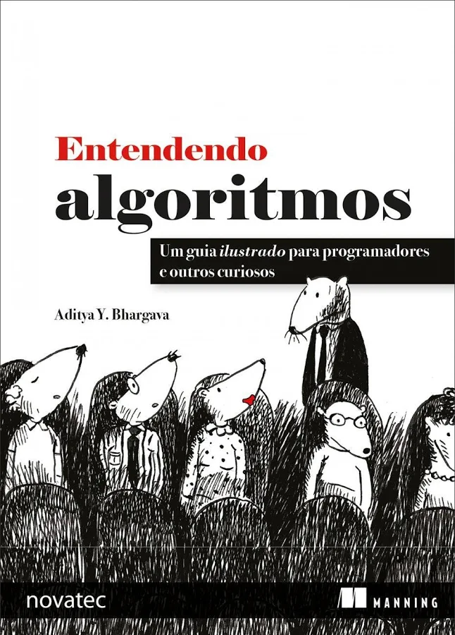
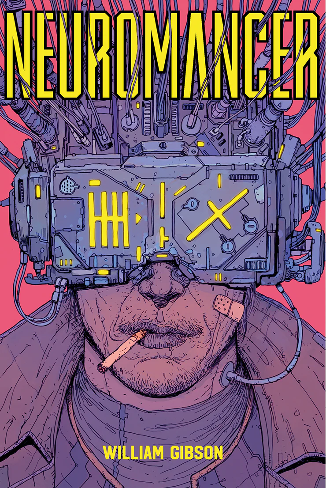

# projeto1-siteFacul
<!DOCTYPE html>
<html lang="en">
<head>

    <meta charset="UTF-8">
    <meta name="viewport" content="width=device-width, initial-scale=1.0">
    <title>Biblionline</title>

    <link rel="stylesheet" href="siteCSS.css">
    
</head>
<body>
    

        <h1>BEM-VINDO À BIBLIONLINE</h1>
    

    
 
        
<strong>Pesquisar por nome:</strong>

        <input type="text" placeholder="Título do livro">

        
<strong>Selecione por Tipo:</strong>

    

        <button class="listaTipo" id="tipos">
        Selecione o tipo
        ▼
</button>
    

        
Ficção Científica (FC)

        
Romance (RO)

        
Divulgação Científica (DC)

    

    

        

    

        <a href="https://www.amazon.com.br/Entendendo-Algoritmos-Ilustrado-Programadores-Curiosos/dp/8575225634/ref=sr_1_1?crid=2QNN9LGUH01VE&dib=eyJ2IjoiMSJ9.-Ji9GX_3ouLtmbRUcyx7lLtiLEosDn0fMDWAWq3nCTO98qiSW53cxWBMKkKgr4olDDnZm8qrpy9YtZ0xwSSonNrKodNxPz5v9EK2RHKY7Sj1-Q6vU3kdthSVDfoiCfPRiS3-rhegusWqiZpcLFKJLtdvdv9NY76LseOnmLkkIPuLhQB_eQXf3rZbnnHU6G5yYaPr_rmlynWCj7umxhUHNXB3XS_7PE-mEFva-Pkg9q4cYjUmqs-DH6PqMXXzz_QfQgrpsqi2BbYzJLWCehxJ9gck1YsiGqhjDEZqXHQKLnQ.tZ5g5YuKcj6qfv-YTQDqKE76ycbF41u-h0Pwd--NHRw&dib_tag=se&keywords=entendendo+algoritmos&qid=1782517017&sprefix=entendendo%2Caps%2C242&sr=8-1" target="_blank">
    
</a>

        

        
ENTENDENDO ALGORITMOS

        
Um guia ilustrado para programadores e outros curiosos. Um algoritmo nada mais é do que um procedimento passo a passo para a resolução de um problema. Os algoritmos que você mais utilizará como um programador já foram descobertos, testados e provados. Se você quer entendê-los, mas se recusa a estudar páginas e mais páginas de provas, este é o livro certo. Este guia cativante e completamente ilustrado torna simples aprender como utilizar os principais algoritmos nos seus programas. O livro Entendendo Algoritmos apresenta uma abordagem agradável para esse tópico essencial da ciência da computação. Nele, você aprenderá como aplicar algoritmos comuns nos problemas de programação enfrentados diariamente. Você começará com tarefas básicas como a ordenação e a pesquisa. Com a prática, você enfrentará problemas mais complexos, como a compressão de dados e a inteligência artificial. Cada exemplo é apresentado em detalhes e inclui diagramas e códigos completos em Python. Ao final deste livro, você terá dominado algoritmos amplamente aplicáveis e saberá quando e onde utilizá-los. O que este livro inclui A abordagem de algoritmos de pesquisa, ordenação e algoritmos gráficos Mais de 400 imagens com descrições detalhadas Comparações de desempenho entre algoritmos Exemplos de código em Python. Este livro de fácil leitura e repleto de imagens é destinado a programadores autodidatas, engenheiros ou pessoas que gostariam de recordar o assunto.

        
Clique no livro, para ir direto à página de compra na Amazon!

        

    

        

    

        <a href="https://www.amazon.com.br/Neuromancer-William-Gibson/dp/8576573008/ref=sr_1_1?crid=2DLL5JGHLEAVP&dib=eyJ2IjoiMSJ9.Y5gWso3hi6qbXTmLGMGrxxVJh-51wTgfvlsMpyHMuFK_5D33A0TdCalBpMBnWgR8Z97UMn8ytd7P4d8ZaZ73irw1qVYJLHydLvjJmuO5hvm3WV9h2nhB9B6KlmhEM8HiuMDwH6m3sEZS9vQvlr6Ehn7g3jB9hpDLql-pPF64WN6mhjKBW0TVO_83ydJ4bM4VcCzMEt2N22s2GGc8Xbb0usht1JMUYLGKulkj-aGPV22uOI5XBeTSn-1s8swEvcC-lmvjHjHNOqSSxxLDHzWZy3B2-S3n9GdtaKzzgg1daak.pV4pXz8Az_95VImme34oOVN48ePIILiVHgy-aBh85VQ&dib_tag=se&keywords=neuromancer&qid=1782516980&sprefix=neuro%2Caps%2C240&sr=8-1" target="_blank">
    
</a>

        

        
NEUROMANCER

        
O Céu sobre o porto tinha cor de televisão num canal fora do ar. Considerada a obra precursora do movimento cyberpunk e um clássico da ficção científica moderna, Neuromancer conta a história de Case, um cowboy do ciberespaço e hacker da matrix. Como punição por tentar enganar os patrões, seu sistema nervoso foi contaminado por uma toxina que o impede de entrar no mundo virtual. Agora, ele vaga pelos subúrbios de Tóquio, cometendo pequenos crimes para sobreviver, e acaba se envolvendo em uma jornada que mudará para sempre o mundo e a percepção da realidade. Evoluindo de Blade Runner e antecipando Matrix, Neuromancer é o romance de estreia de William Gibson. Esta obra distópica, publicada em 1984, antevê, de modo muito preciso, vários aspectos fundamentais da sociedade atual e de sua relação com a tecnologia. Foi o primeiro livro a ganhar a chamada “tríplice coroa da ficção científica”: os prestigiados prêmios Hugo, Nebula e Philip K. Dick.

        
Clique no livro, para ir direto à página de compra na Amazon!

        

    

        

    

        <a href="https://www.amazon.com.br/Crime-castigo-Fiódor-Dostoiévski/dp/8573266465/ref=sr_1_1?crid=1AJ0QZTW9K1TB&dib=eyJ2IjoiMSJ9.PRnwBBSIlrA4IYjHcnm4dNswkYAKCwjZMyaYQRMIdI4XnoS2lSN2eUfKP1IFBOsV3BGUUT7VgKS-wgY9_S1Y8NiNfMFDJOnPz9uVWJ8dT1zJLyHY1QMs5ies4ssRFrrjCszzt5u8RzHuG_RROgclg3bvUa-QOzuLtHRvM51LqakfYZA6v1N_97qrufWQWUQ7CdJq33IMlEoTelc5AkowX9FhQGv78noD331c_Px46WBjkc0YO0Sw4zAjvKvGGX8gIPxWG99Z4Sb3Qo54VCrSMAqb2FX8itZzb42nLcCyQ00.27VM28TfeLlUrMjE8w8UQ6oK_jR5Vqw3-QUEcTkHmNc&dib_tag=se&keywords=livro+crime+e+castigo+dostoievski&qid=1782516822&sprefix=livro+castigo+%2Caps%2C347&sr=8-1" target="_blank">
    
</a>

        

        
CRIME E CASTIGO

        
Publicado em 1866, Crime e castigo é a obra mais célebre de Fiódor Dostoiévski. Neste livro, Raskólnikov, um jovem estudante, pobre e desesperado, perambula pelas ruas de São Petersburgo até cometer um crime que tentará justificar por uma teoria: grandes homens, como César ou Napoleão, foram assassinos absolvidos pela História. Este ato desencadeia uma narrativa labiríntica que arrasta o leitor por becos, tabernas e pequenos cômodos, povoados de personagens que lutam para preservar sua dignidade contra as várias formas da tirania. Esta é a primeira tradução direta da obra lançada no Brasil, e recebeu em 2002 o Prêmio Paulo Rónai de Tradução da Fundação Biblioteca Nacional.

        
Clique no livro, para ir direto à página de compra na Amazon!

        

    

    
</body>
</html>
===============================================================================================================================================================================
#CSS

body{
    background-color: rgb(100, 66, 21);
    background-image: url(backgroundLivros.jpg);
    background-repeat: no-repeat;
    background-size: cover;
    background-position: center;
    background-attachment: fixed;
}

.titulo{
    color: rgb(255, 255, 255);
    background-color: rgb(165, 129, 81);
    font-size: 25px;
    border-radius: 10px;
    border-color: rgb(255, 174, 0);
    border-style: solid;
    text-align: center;
}

.barraDePesquisa{
    display: flex;
    margin-top: 40px;
    color: rgb(255, 255, 255);
    gap: 10px;
}

input{
    border-radius: 4px;
    border-color: rgb(255, 174, 0);
    background-color: rgb(100, 66, 21);
    border-width: 3px;
    border-style: solid;
}

::placeholder{
    color: white;
}

.listaTipo{
    color: white;
    border-radius: 4px;
    border-color: rgb(255, 174, 0);
    background-color: rgb(100, 66, 21);
    border-width: 3px;
    border-style: solid;
}

.procuraPorTipo{
    position: relative;
    display: flex;
    align-items: center;
}

.opcoesTipo{
    position: absolute;
    top: calc(100% + 8px); /* Posiciona o menu exatamente 8px abaixo do botão */
    left: 0;
    width: 100%;

    opacity: 0;             /* Torna o menu completamente invisível */
    visibility: hidden;     /* Impede que o utilizador clique acidentalmente nas opções invisíveis */
    transform: translateY(-10px) scale(0.95); /* Desloca o menu ligeiramente para cima e encolhe */
    
    transition: opacity 0.2s ease, transform 0.2s ease, visibility 0.2s;

    color: white;
    border-radius: 4px;
    border-color: rgb(255, 174, 0);
    background-color: rgb(100, 66, 21);
    border-width: 3px;
    border-style: solid;
}

.opcoesTipo.aberto{
    opacity: 1;
    visibility: visible;
    transform: translateY(0) scale(1); /* O menu volta ao seu tamanho normal e desce para a posição correta */
    
}

.opcao-customizada{
    color: white;
    border-color: rgb(255, 174, 0);
    background-color: rgb(100, 66, 21);
    border-style: solid;
}

.listaTipo.ativo .seta{
    transform: rotate(180deg);
}

.balcao{
    margin-top: 10px;
    background-color: rgb(192, 149, 94);
    border-style: solid;
    border-radius: 20px;
    border-color: rgb(255, 174, 0);
}

img{
    width: 250px;
}

.bordaLivro{
    border-style: solid;
    border-radius: 10px;
    border-color: rgb(100, 66, 21);
    border-width: 40px;
    margin-top: 130px;
    margin-right: 130px;
    margin-left: 130px;
    margin-bottom: 15px;
}

.livro{ /* classe necessária para definir as propriedades da imagem da capa dos livros*/
    display: flex;
    align-items: flex-start; /*comando novo: irá alinhar os itens pelo topo da div*/
    gap: 20px; /*comando novo: margem entre o texto e a imagem da capa*/
    text-align: justify;
    padding: 30px;
    border-style: solid;
    border-radius: 4px;
    border-color: rgb(255, 174, 0);
}

.infoLivro{
    background-color: rgb(100, 66, 21);
    border-radius: 10px;
    border-style: solid;
    border-color: bisque;
    padding: 10px;
}

.infoLivro p{
    color: white
}

div p:nth-of-type(1){
    text-align: center;
}
===============================================================================================================================================================================
#JavaScript

const botao = document.getElementById('tipos');
const menu = document.getElementById('menuProcuraPorTipo');
const textoSelecionado = document.getElementById('TipoSelecionado');
const opcoes = document.querySelectorAll('.opcao-customizada');

botao.addEventListener('click', function(evento) {
    evento.stopPropagation(); // MUITO IMPORTANTE!
    menu.classList.toggle('aberto');
    botao.classList.toggle('ativo');
});

opcoes.forEach(function(opcao) {
    opcao.addEventListener('click', function() {
        textoSelecionado.textContent = this.textContent; // Atualiza o texto do botão
        
        menu.classList.remove('aberto'); // Fecha o menu
        botao.classList.remove('ativo');  // Remove o estado ativo do botão
        
        console.log("Selecionado: " + this.getAttribute('data-valor')); // Captura o valor (ex: "pt")
    });
});

document.addEventListener('click', function() {
    menu.classList.remove('aberto');
    botao.classList.remove('ativo');
});
